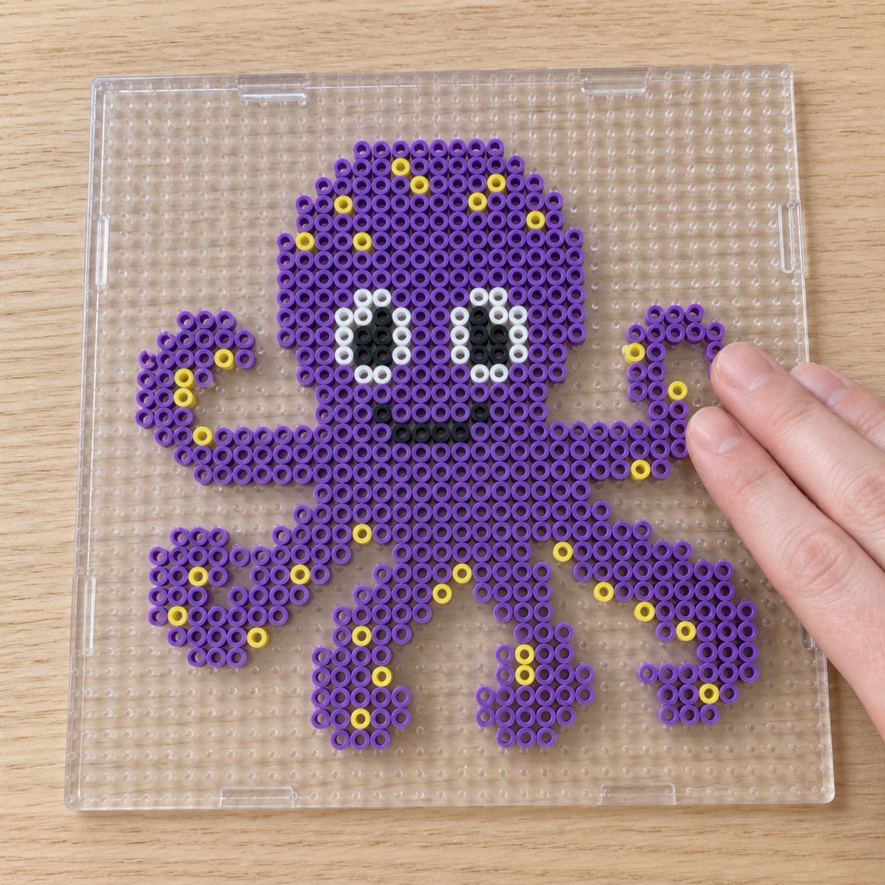
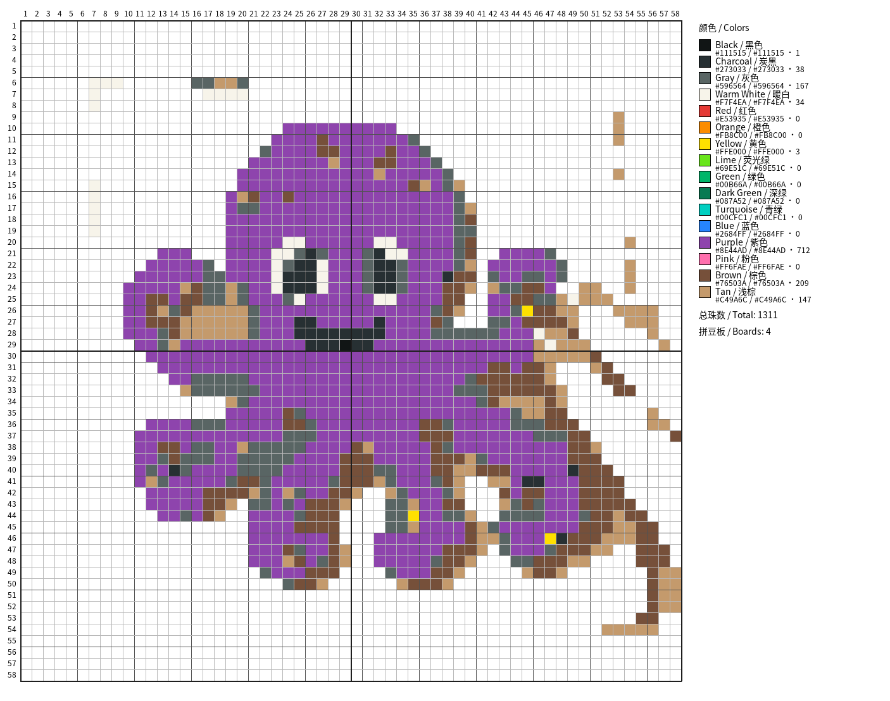
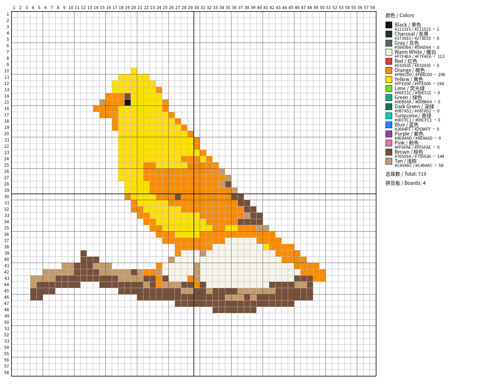
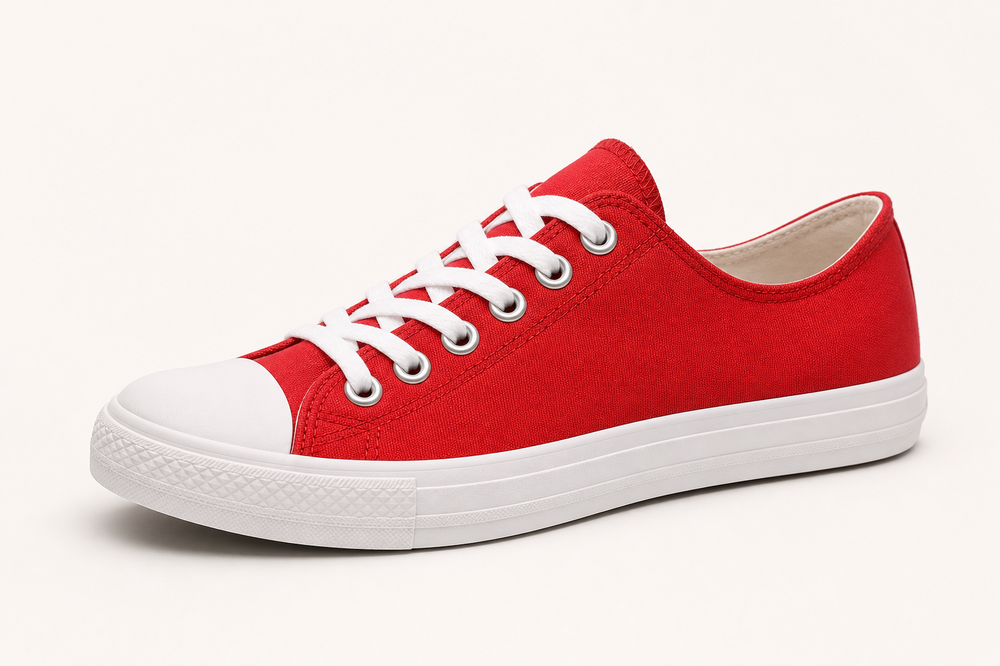
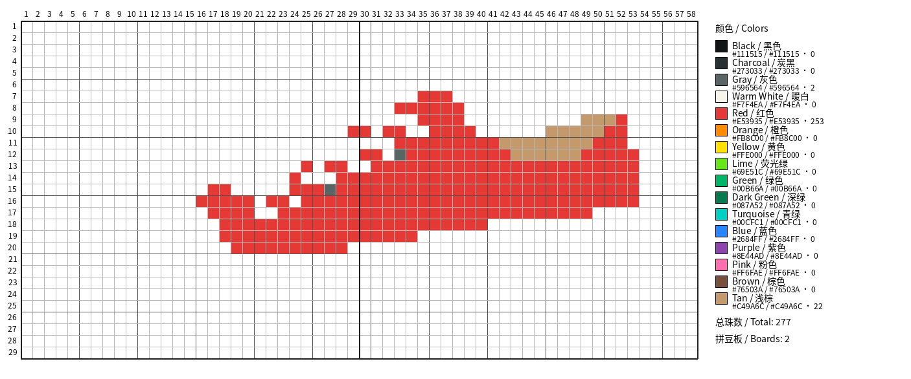
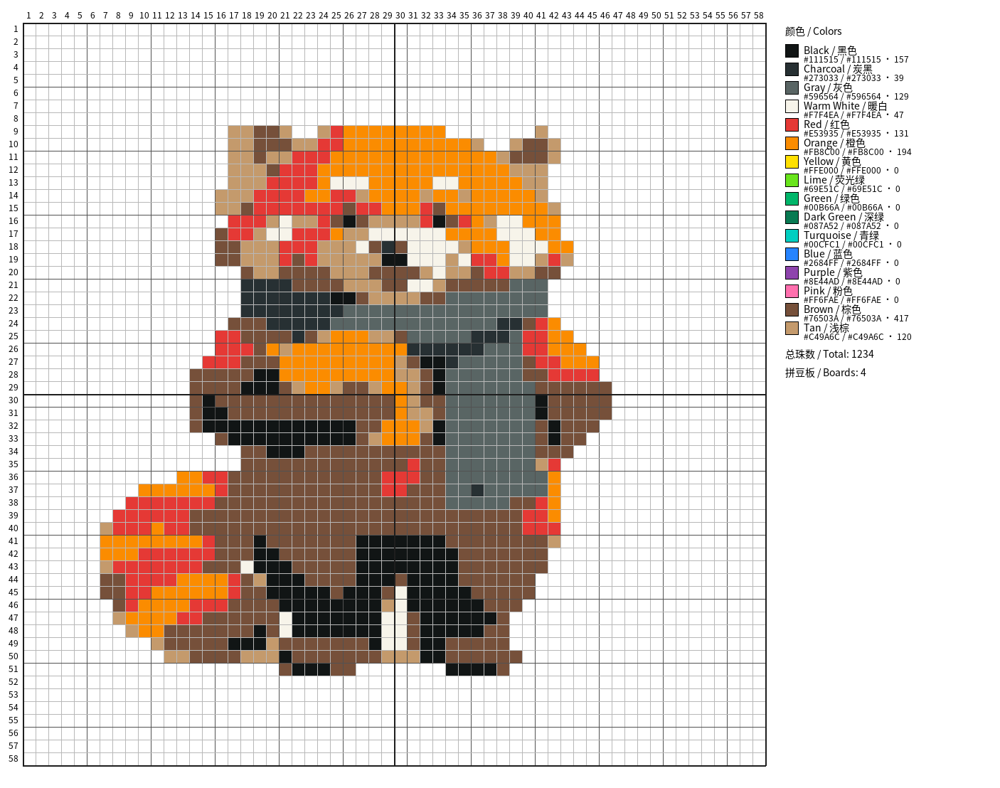

[中文](README.md)

# Fuse Bead Designer

Send a finished-bead photo, pixel art, object photo, or high-resolution illustration to an Agent and receive a buildable grid, per-color quantities, and a reviewable report. The Agent understands and prepares the visual content; the deterministic compiler accepts only a confirmed logical pattern and derives the grid and counts from the same `pattern.json` instead of guessing from a rendered image.


## First use: send this sentence to your Agent

> Please install this Codex plugin: https://github.com/MrLQQ/fuse-bead-designer. Complete the installation yourself; after it succeeds, stop. Do not run examples or install additional runtime dependencies; only remind me to start a new task.

Installation changes the local environment, so the Agent asks for permission once. After approval, the Agent checks and completes installation internally; you do not need to copy terminal commands. It stops after installation; start a new task and then send the image request below.

## Everyday use: upload an image and describe the result

Attach the source image in an image-capable Agent conversation, then send:

> Turn the attached image into a fuse-bead pattern

You can add natural constraints such as “prefer standard 29 × 29 boards,” “preserve white beads,” or “do not guess behind this occlusion; mark it for my review.” The normal flow does not expose a Skill token or require local commands.

## The v0.3 pattern-first flow

v0.3 deliberately separates understanding an image from producing a countable pattern. First establish a logical pattern with verified dimensions; then the deterministic compiler maps colors, calculates counts, derives the board layout, and renders the deliverables. The three input routes are:

1. **Finished-bead photo**: exclude fingers, tables, glare, and other interference, correct perspective, and produce a front-facing grid with declared dimensions. Only a rectified regular grid may enter the compiler.
2. **Pixel art or an existing pattern**: verify its logical width and height, then compile it directly. Automatic grid recovery is allowed only when a unique nearest-neighbor scale is provable; ambiguous interpretations stop for confirmation.
3. **Ordinary photo or high-resolution illustration**: first use image understanding or editing to create a plain, grid-aligned **semantic pattern draft**, then verify its dimensions and compile it. The draft expresses the buildable shapes and color regions; it does not contain quantities or the final legend.

An ordinary photo has no pre-existing bead grid. This project does not automatically detect a general bead lattice in ordinary photos or treat display pixels as beads; those sources require a semantic design decision first. A finished-bead photo must likewise be perspective-corrected and assigned an explicit grid instead of guessing final cells from a tilted, occluded, or reflective image.

## Pattern dimensions, boards, and counts

**Fix the pattern dimensions before deriving the board layout.** The compiler accepts an arbitrary positive integer width and height. A 29 × 29 board is a standard physical module, not a constraint on the logical pattern. Once the dimensions are fixed, the compiler calculates the necessary full or partial boards, so sizes such as 37 × 22 or 68 × 60 remain representable without padding the design.

`pattern.json` is the canonical source. The template, per-color list, and total all use deterministic counts from the same logical grid: a fixed draft, width, height, and palette produce the same result. “Exact” means exact for that current pattern; it does not turn source ambiguity into fact.

Occluded content is recorded as **inferred regions** only when the reconstruction is limited, explainable, and reproducible, with state `inferred-low`. Large, important, or multiply plausible gaps remain `review-required`. Counts in inferred regions are provisional and should not drive purchases before review.

## From source image to buildable pattern

All four rows below use real repository inputs and deterministic compiler output. They are not illustrative mockups.

<table>
  <tr>
    <th>Scenario</th>
    <th>Source</th>
    <th>Fuse-bead template</th>
    <th>Result</th>
  </tr>
  <tr>
    <td><strong>Occluded finished beads</strong><br>Fingers, board, and scene interference</td>
    <td></td>
    <td></td>
    <td>58 × 58<br>1,525 beads<br><code>review-required</code></td>
  </tr>
  <tr>
    <td><strong>Occluded high-resolution image</strong><br>A label hides part of the subject</td>
    <td></td>
    <td></td>
    <td>58 × 58<br>719 beads<br><code>review-required</code></td>
  </tr>
  <tr>
    <td><strong>Actual object photo</strong><br>Subject extracted from a studio background</td>
    <td></td>
    <td></td>
    <td>58 × 29<br>501 beads<br><code>verified</code></td>
  </tr>
  <tr>
    <td><strong>High-resolution non-pixel illustration</strong><br>Continuous color reduced to a discrete grid</td>
    <td></td>
    <td></td>
    <td>58 × 58<br>1,234 beads<br><code>verified</code></td>
  </tr>
</table>

## What you receive

Each generation delivers:

- `template.png`: buildable coordinates, five-cell guides, standard-board boundaries, and a modern quantity legend.
- `colors.csv`: colors actually used, hex values, optional supplied brand codes, and exact counts.
- `pattern.json`: the canonical grid, palette, board layout, and per-color counts.
- `report.json`: input classification, cleanup record, sizing decision, warnings, and verification state.
- `review.png`: focused uncertainty markers when cleanup or inferred regions need review.

Verification states are operational:

- `verified`: no semantic reconstruction affected the subject; counts belong to the confirmed design.
- `inferred-low`: only limited, explainable reconstruction was used; inspect the markers.
- `review-required`: a key region remains uncertain. Counts are provisional; inspect `review.png` and `report.json` before buying beads or building.

The default palette is generic and never invents brand codes; `brand_code` is retained only when you supply a brand palette.

## Codex and other Agent hosts

Codex installs the full Plugin where possible. Other [Agent Skills](https://agentskills.io/)-compatible tools can install the standalone Skill from the Release. Installation locations, permission models, image understanding, and image editing capabilities vary by host, so the same natural-language request can trigger different internal steps.

For normal users, the boundary remains the same: send the installation prompt and an image request. The Agent obtains installation permission and performs supported installation itself. If the host lacks a required image capability, it should explain the limitation and ask for a better source instead of inventing subject detail or hidden regions.

## Developer: advanced and debugging

> The commands below are only for Agent implementers, maintainers, and developers debugging the compiler. Normal users should not run them; use the natural-language workflow above.

### Codex Marketplace / Plugin

Install the fixed v0.3.0 release:

```bash
codex plugin marketplace add MrLQQ/fuse-bead-designer --ref v0.3.0
codex plugin add fuse-bead-designer@fuse-bead-designer
```

Debug from a local clone:

```bash
git clone https://github.com/MrLQQ/fuse-bead-designer.git
cd fuse-bead-designer
codex plugin marketplace add "$PWD"
codex plugin add fuse-bead-designer@fuse-bead-designer
```

### Standalone Skill

```bash
cp -R plugins/fuse-bead-designer/skills/create-fuse-bead-patterns \
  "${CODEX_HOME:-$HOME/.codex}/skills/"
```

### Local development, tests, and packaging

```bash
python -m pip install -e ".[test]"
pytest -q
python tools/package_release.py
```

v0.3.0 packaging writes:

```text
dist/fuse-bead-designer-plugin-v0.3.0.zip
dist/create-fuse-bead-patterns-skill-v0.3.0.zip
```

### Direct deterministic compiler use

The Agent normally calls the compiler internally. Run it directly only for debugging:

```bash
python plugins/fuse-bead-designer/skills/create-fuse-bead-patterns/scripts/create_pattern.py \
  --input examples/intermediates/occluded-finished-beads-clean.png \
  --output-dir work/occluded-pattern \
  --width 58 --height 58 \
  --palette examples/palettes/octopus-generic.json \
  --verification review-required \
  --classification finished-bead-photo \
  --removed-interference hand fingers wooden-table transparent-pegboard pegs glare shadows background
```

Explicit sizing requires both width and height. More than four boards requires explicit confirmation. The compiler refuses a non-empty output directory unless a developer deliberately uses its force option. Custom palettes may be JSON entries with `id`, `name`, `name_zh`, `hex`, and optional `brand_code`, or a CSV with the exact header `id,name,name_zh,hex,brand_code`.

## Contributing

See [CONTRIBUTING.md](CONTRIBUTING.md). Public examples must be redistributable. Never commit user images, credentials, or private intermediates from `work/`.

## License

[MIT](LICENSE) © 2026 MrLQQ.
