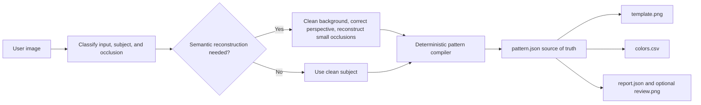

# Fuse Bead Designer: Open-Source Plugin and Skill Design

## 1. Goal

Create an MIT-licensed open-source repository at
`MrLQQ/fuse-bead-designer` that turns varied reference images into
reviewable, count-accurate fuse-bead templates.

The repository must serve two distribution paths:

- a Codex Plugin that can be installed from a repository-backed marketplace;
- a self-contained Agent Skill that can be copied into other
  Agent-Skills-compatible tools.

The system must accept:

- photographs of finished fuse-bead work;
- existing pixel art;
- ordinary high-resolution photographs or illustrations.

It must distinguish the intended subject from hands, tools, tables, shadows,
reflections, and unrelated objects. It may infer small occluded regions, but
must expose uncertainty instead of silently presenting guesses as facts.

## 2. First-Principles Boundary

The workflow separates semantic judgment from deterministic computation:

- an image-capable agent identifies the subject, classifies the source, removes
  irrelevant content, corrects perspective, and reconstructs limited
  occlusions;
- a deterministic Python compiler selects a board size, creates cells, maps
  colors, counts beads, and renders outputs.

Image models must not be asked to produce the final countable grid, legend, or
quantity table. They cannot guarantee exact cell dimensions or counts.

The structured cell grid is the source of truth. Rendered images and color
tables are derived from it, never sampled back from a generated grid image.

## 3. Repository and Distribution Structure

```text
fuse-bead-designer/
├── .agents/plugins/marketplace.json
├── plugins/fuse-bead-designer/
│   ├── .codex-plugin/plugin.json
│   ├── skills/create-fuse-bead-patterns/
│   │   ├── SKILL.md
│   │   ├── agents/openai.yaml
│   │   ├── scripts/
│   │   ├── references/
│   │   └── assets/
│   └── assets/
├── examples/
├── tests/
├── .github/workflows/ci.yml
├── README.md
├── README.zh-CN.md
├── CONTRIBUTING.md
├── LICENSE
└── pyproject.toml
```

The marketplace entry, plugin directory, and plugin manifest use the name
`fuse-bead-designer`. The portable skill uses the verb-led name
`create-fuse-bead-patterns`.

The skill contains all operational logic and portable assets. The plugin is a
distribution and presentation wrapper, not a second implementation.

## 4. Processing Architecture



### 4.1 Input classification

Classify every input as one of:

- `finished-bead-photo`;
- `pixel-art`;
- `high-resolution-image`.

Record the classification and its evidence in `report.json`.

### 4.2 Subject handling

- If one subject is visually dominant, isolate it automatically.
- If multiple plausible subjects exist, ask the user to select one.
- Remove unrelated objects that do not cover the subject.
- Correct perspective for angled photographs before sampling bead positions.
- Do not treat shadows, glare, board color, or background texture as beads.

### 4.3 Occlusion policy

- Small, structurally recoverable occlusions may be inferred from silhouette,
  symmetry, repeated motifs, and visible context.
- Inferred regions must be marked in `review.png` and described in
  `report.json`.
- Large occlusions or missing identity-defining features set the result to
  `review-required`.
- A `review-required` result may include a candidate pattern, but quantities
  must be labeled provisional until the user confirms it.

### 4.4 Image-tool role

When a host provides an image editing or generation tool, use it only to
produce a clean, front-facing, flat subject intermediate. It must not add a
grid, legend, labels, text, or decorative objects.

After every image-tool operation, re-check:

- subject identity;
- silhouette and proportions;
- pose and key features;
- removed and added objects;
- reconstructed regions.

When the host has no image capability, accept only inputs whose subject is
already clear enough for deterministic processing. Stop on unresolved
occlusion or ambiguity.

## 5. Pattern Compiler

### 5.1 Board selection

Prefer standard 29-by-29 square-board modules.

Evaluate these candidates first:

- 29x29;
- 58x29;
- 29x58;
- 58x58.

Recommend larger combinations such as 87x58 or 58x87 only when the smaller
choices materially damage recognition or crop the subject. Ask before
finalizing a design that requires more than four boards, unless the user
already specified the size or board count.

Score candidates using:

- subject crop loss;
- unused-space ratio;
- silhouette retention;
- key-feature legibility;
- total bead count;
- board count.

When two candidates are materially equivalent, render compact candidate
previews and ask the user to choose. Explicit width, height, maximum bead count,
or board-count instructions override automatic selection.

Custom cell dimensions are allowed when standard modules cause severe crop or
space waste. Mark custom dimensions as not exactly matching standard boards.

### 5.2 Empty cells and white beads

Derive cell occupancy from a subject mask before color mapping.

Represent an empty cell independently from a palette color. Never infer
emptiness solely because a sampled color is white or near-white. This preserves
white beads on a white template background.

### 5.3 Color mapping

- Bundle a generic, named color palette.
- Select 8 to 16 colors by default.
- Use perceptual color distance rather than raw RGB Euclidean distance.
- Disable dithering by default to avoid scattered, hard-to-build cells.
- Accept a user-provided CSV or JSON brand/inventory palette.
- Map only to colors present in the supplied palette.
- Never invent an official brand name or code.
- Report substituted nearest colors when exact matches are unavailable.

### 5.4 Conservative cleanup

Remove isolated noise and reduce staircase artifacts conservatively. Protect
single-cell features that may carry meaning, including eyes, highlights,
corners, and outline tips.

Record every cleanup change. If cleanup alters a material portion of the
pattern or a salient feature, provide before-and-after previews for review.

## 6. Structured Outputs

### 6.1 `pattern.json`

`pattern.json` is the canonical artifact. It records:

- schema version;
- grid width and height;
- board module size and board layout;
- palette entries;
- a row-major cell matrix using `empty` or a palette identifier;
- total bead count;
- per-color counts;
- uncertainty state;
- inferred cell regions;
- compiler settings.

### 6.2 Derived artifacts

- `template.png`: buildable grid with legend.
- `colors.csv`: palette name, optional brand code, hex value, and exact count.
- `report.json`: classification, removed interference, inferred areas, board
  decision, palette decision, warnings, and verification state.
- `review.png`: generated only when inferred or disputed areas need visual
  review.

The template includes:

- thin cell lines;
- stronger lines every five cells;
- distinct boundaries at each 29-cell module edge when a standard board layout
  is selected;
- row and column coordinates;
- color name, value or code, and quantity;
- total beads and required board count.

## 7. Verification States

- `verified`: no semantic reconstruction affected the subject.
- `inferred-low`: limited, explainable reconstruction; review overlay and
  quantities are provided.
- `review-required`: a key region is uncertain; quantities are provisional.

The workflow must not present `review-required` quantities as confirmed.

## 8. Portability and Dependencies

- Target Python 3.10 or newer.
- Keep runtime dependencies to the standard library and Pillow where practical.
- Use relative paths only.
- Do not require an OpenAI API key for deterministic compilation.
- Do not embed a Codex-only tool call in the compiler.
- Describe semantic-image capability by role in the portable skill, with a
  Codex-specific preferred path where available.
- Never commit credentials, user images, or generated private inputs.

## 9. Documentation

`README.md` is the English primary document. `README.zh-CN.md` provides the
Chinese version. Both cover:

- project purpose and honest capability boundaries;
- real output screenshots;
- supported input types;
- Codex marketplace installation;
- standalone Agent Skill installation;
- copying the skill into other compatible agent tools;
- basic and advanced examples;
- output file definitions;
- standard and custom board sizing;
- generic and brand palette usage;
- uncertainty and review behavior;
- dependencies and troubleshooting;
- contribution and license information.

Screenshots must come from the real compiler. Image generation may provide
open-source example subjects and an optional plugin icon, but must not fabricate
technical output screenshots.

## 10. Testing

### 10.1 Deterministic tests

Test:

- standard and custom board selection;
- white-bead and empty-cell separation;
- palette mapping and invalid palette rejection;
- count agreement across JSON, CSV, and rendered legend;
- board boundary placement;
- deterministic repeated runs;
- schema validation;
- invalid and contradictory options.

### 10.2 Scenario tests

Use openly distributable fixtures for:

- clean pixel art;
- a high-resolution non-pixel illustration;
- a finished bead photograph with a hand occlusion;
- a complex background;
- ambiguous multiple subjects;
- transparent input;
- a supplied brand palette.

### 10.3 Skill forward tests

Record baseline agent behavior without the skill, then repeat equivalent tasks
with the skill. Verify that the skilled agent:

- classifies the input;
- excludes interference;
- pauses on ambiguity;
- marks inferred content;
- uses the deterministic compiler;
- reports exact counts only when allowed by the verification state.

### 10.4 Continuous integration

GitHub Actions validates:

- Python tests;
- Agent Skill format;
- plugin manifest;
- marketplace structure;
- documented commands and paths;
- example count and dimension consistency.

## 11. Open-Source Release

- License: MIT.
- Repository: `MrLQQ/fuse-bead-designer`.
- Visibility: public.
- Default branch: `main`.
- Initial release: `v0.1.0`.
- Release assets: complete Codex Plugin archive and standalone Agent Skill
  archive.

The local repository is initialized before implementation. The first public
push occurs only after tests, plugin validation, skill validation, and README
verification pass.

Current publishing constraint: the local machine has no `gh` executable and the
Codex GitHub connector has no installed account. Repository creation should
first use the user's authenticated GitHub browser session. If Git push still
requires authentication, pause for a secure GitHub authentication path; never
request a plaintext token in chat.

## 12. Non-Goals for v0.1.0

- interactive graphical cell editor;
- hosted web application;
- MCP server;
- automatic purchasing or inventory management;
- claims of official compatibility with a bead brand without its supplied
  palette data;
- guaranteed reconstruction of heavily occluded subjects.

## 13. Acceptance Criteria

The initial release is complete when:

- the repository matches the documented marketplace/plugin/skill structure;
- a clean input produces valid JSON, PNG, CSV, and report artifacts;
- all counts derive from `pattern.json` and agree exactly;
- white beads remain distinct from empty cells;
- standard board boundaries and required board count are shown;
- ambiguous or heavily occluded inputs do not silently produce confirmed
  counts;
- the plugin and skill validators pass;
- the automated test suite passes;
- English and Chinese installation instructions have been exercised;
- the public GitHub repository and `v0.1.0` release are available.
